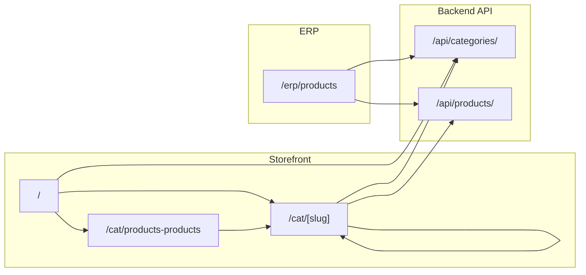

# E-commerce storefront and category navigation

## Current state

- **Landing**: [nextjs_frontend/songfei/src/app/page.tsx](nextjs_frontend/songfei/src/app/page.tsx) is a simple hero with "Songfei Store", no category slider.
- **Root layout**: [nextjs_frontend/songfei/src/app/layout.tsx](nextjs_frontend/songfei/src/app/layout.tsx) uses a single header "Songfei ERP" with Overview, ERP, Inventory, Employees and "Launch ERP" for all routes.
- **ERP**: [nextjs_frontend/songfei/src/app/erp/product/page.tsx](nextjs_frontend/songfei/src/app/erp/product/page.tsx) is a stub; sidebar in [erp/layout.tsx](nextjs_frontend/songfei/src/app/erp/layout.tsx) links to `/erp/products` but the route is `/erp/product` (folder name mismatch).
- **Backend**: [django_backend/core/models.py](django_backend/core/models.py) has `Product` (name, price, description, image_url) and no category or hierarchy.
- **Styling**: [globals.css](nextjs_frontend/songfei/src/app/globals.css) defines the current palette (dark theme, --ink-1, --bg-1, --accent-1/2/3, etc.) and fonts (Literata, Unbounded) — keep as-is for the storefront.

## Architecture (high level)

- **Store header** (only on `/`, `/cat/*`, `/products`): store branding, search bar, cart, **ERP** button → `/erp`. Do not show this header on `/erp/*` or `/login`. Use a **single root layout** that conditionally renders store header vs minimal header based on pathname (see Route/layout split below). This approach is more extensible: you can add more pathname checks (e.g. `/admin`, `/reports`) and render different headers per module; or use a mapping of path prefixes to header configs for future modules.
- **Landing** (`/`): hero + **category slider** (level-1 categories). Each tile links to `/cat/[slug]`. Empty state when no categories.
- **Big catalogue** (`/cat/products-products`): one section per root category; each section: image, title, "Shop all" → same URL as that category in the slider (e.g. Tables & chairs → `/cat/tables-chairs-fu002`), plus list of subcategory links.
- **Category page** (`/cat/[slug]`): breadcrumb (Products > … > current); if category has **children** → subcategory slider (first tile "up" to parent) then **main body**:
  - **Level 2 only** (direct child of root): main body shows **CTA blocks** (e.g. "Discover new offers for IKEA Family members*") — no product grid. Same behaviour for all main/level-2 categories.
  - **Level 3 and onward**: main body shows **product grid** with products from this category and all descendants (recursively). Left sidebar filters (colour, material, sort, best seller, new) driven by product attributes.
- If category has **no children** (leaf): no slider, product grid + left sidebar filters. Products = those whose `category` is this node.
- **ERP product page** (`/erp/products`): category picker (step-by-step until leaf) with **"Create new subcategory"** option; product form with attributes for filtering; save with category. After save, "Add another" resets form and clears category.
- **Search**: store header search submits to `/products?query=...` — IKEA-like: full navigation load.

## Backend (Django)

1. **Category model** (new)
  - `parent` (ForeignKey to self, null=True)
  - `name`, `slug` (unique), `image_url` (optional), `display_order` (int, default 0)
  - **Slug uniqueness**: slug must be globally unique. Use `slugify(name) + "-" + short_unique_suffix` (e.g. last 6 chars of UUID, or sequential code like `fu002`). On save: if slug exists, append suffix until unique. DB unique constraint on `slug`.
2. **Product model** (extend)
  - `category` (ForeignKey to Category, null=True, related_name='products')
  - `slug` (unique): IKEA-style format e.g. `bekvaem-step-stool-aspen-50225592` for product detail URLs (`/p/[slug]/`). Use `slugify(name) + "-" + str(id)` or `slugify(name) + "-" + product_code` to guarantee uniqueness.
  - **Attributes for filtering** (staff enters in ERP): `colour` (CharField or FK to Colour), `material` (CharField or FK), `is_best_seller` (BooleanField), `is_new` (BooleanField). Add fields as needed for Sort, Colour, Material, Best seller, New filters.
3. **Migrations** for Category and Product.category.
4. **API**
  - Categories: list (filter by `parent` for children; `parent__isnull=True` for roots). Include in response: id, name, slug, image_url, parent, display_order, and optionally children or child count.
  - Single category by slug: GET `/api/categories/?slug=...` or `/api/categories/[id]/` for breadcrumb and slider data.
  - Products: existing ViewSet; add filter by `category` (and optionally by category tree for non-leaf). Add search on name/description (e.g. `?search=...`) for store search bar.
5. **Admin**: register Category; optionally inline Category in Product for quick edits.

**Slug uniqueness (how to keep each slug unique)**:

- **Categories**: `slug` has DB unique constraint. When creating: `base = slugify(name)`; if `Category.objects.filter(slug=base).exists()`, append suffix (e.g. last 6 chars of UUID, or sequential: `base + "-" + str(id)` after save). Alternatively: staff can edit slug; validate uniqueness on save; auto-append `-{id}` or `-{code}` on conflict.
- **Products**: IKEA format `bekvaem-step-stool-aspen-50225592` — use `slugify(name) + "-" + str(id)` (guarantees uniqueness) or `slugify(name) + "-" + product_code` if you add a product_code field. Product slugs are unique globally for `/p/[slug]` routing.

## Frontend (Next.js App Router)

1. **Route/layout split**
  - **Preferred**: single root layout that conditionally renders "store header" vs "ERP/minimal header" based on pathname (e.g. `pathname.startsWith('/erp') || pathname.startsWith('/login')` → minimal; else → store header). **ERP button only in store header**, not on ERP pages.
  - **Extensibility**: This approach is more extensible for future modules. Add pathname checks for new modules (e.g. `/admin`, `/reports`) and render different headers per module. Or use a mapping: `{ '/erp': 'erpHeader', '/login': 'minimalHeader', '/': 'storeHeader', ... }` so adding new modules is a config change.
2. **Store header**
  - Logo (link to `/`), primary nav (e.g. Shop products, Deals, etc. if desired), **search bar** (form → GET `/products?query=...` or search page), right side: optional "Log in", wishlist, cart, **ERP** button (link to `/erp`). Use existing CSS variables and fonts.
3. **Landing page** (`/`)
  - Hero block (keep or refine current hero).
  - **Category slider**: horizontal scroll, fetch root categories from API; each card: image (category.image_url or placeholder), label (category.name), link to `/cat/[slug]`. If no categories, show message "No categories yet — add products in ERP."
  - Optional sections: new arrivals, best sellers — can be placeholders (static list or "Coming soon").
4. **Big catalogue page** (`/cat/products-products`)
  - Page title "Products".
  - One **section per root category** (from API): large image (category.image_url or placeholder), title, **"Shop all"** link to `/cat/[root.slug]` (same as landing slider), then list of links to `/cat/[child.slug]` for each direct child. Same structure as IKEA screenshot 6/7/8.
5. **Category page** (`/cat/[slug]`)
  - Resolve category by slug (fetch from API). If not found, 404.
  - **Breadcrumb**: Products > [parent chain] > [current]. Build from category parent chain (API can return breadcrumb array or parent ids/names).
  - If category has **children**:
    - Subcategory **slider**: first card "up" (arrow + parent name → link to parent or "Products" if root); then one card per child (image, name → `/cat/[child.slug]`).
    - **Main body**:
      - **Level 2 only** (direct child of root): show **CTA blocks** (e.g. "Discover new offers for IKEA Family members*") — no product grid. Same for all main/level-2 categories.
      - **Level 3 and onward**: show **product grid** with products from this category and all descendants (recursively). Left sidebar filters (Sort, Colour, Material, Best seller, New) driven by product attributes.
  - If category has **no children** (leaf): no slider, product grid + left sidebar filters. Products = those whose `category` is this node. Filters use product attributes (colour, material, is_best_seller, is_new).
  - Use existing globals.css; product cards: image, name, price, optional "Best seller" tag.
6. **ERP product page** (`/erp/products`)
  - **Fix route**: move [nextjs_frontend/songfei/src/app/erp/product/page.tsx](nextjs_frontend/songfei/src/app/erp/product/page.tsx) to `erp/products/page.tsx` so the sidebar link `/erp/products` works.
  - **Category picker**: step-by-step. Load root categories → user selects one → load children → select → … until **leaf** (no children). Show path as breadcrumb. **"Create new subcategory"** option: staff can create a new subcategory at any level; save to DB via API (POST `/api/categories/` with parent_id).
  - **Product form**: name, price, description, image_url (default grey placeholder; staff can update image in ERP), category (read-only showing selected leaf), **attributes** (colour, material, is_best_seller, is_new — staff enters when creating). Save → POST to `/api/products/` with category id and attributes. After save, "Add another" **resets form and clears category**.
7. **Search**
  - Store header form `action="/products"`, `name="query"`. Implement `/products` page that lists products filtered by search (API `?search=...`).
8. **Placeholder images**
  - Categories/products without image_url: **default grey background**. Staff can update image in ERP page (paste URL or upload). No automatic "fetch image for bowl" in this phase.

## URL scheme (aligned with IKEA-style)

| Purpose              | URL                                                                                  |
| -------------------- | ------------------------------------------------------------------------------------ |
| Landing              | `/`                                                                                  |
| Big catalogue        | `/cat/products-products`                                                             |
| Category (any level) | `/cat/[slug]` (e.g. `/cat/tables-chairs-fu002`, `/cat/2-seater-dining-tables-57297`) |
| Product detail       | `/p/[slug]` (e.g. `/p/bekvaem-step-stool-aspen-50225592` — IKEA-style)               |
| Search               | `/products?query=...`                                                                |
| ERP                  | `/erp`, `/erp/products`                                                              |

## Implementation order

1. Backend: Category model + migration; Product.category + migration; category API (list roots, list children, get by slug, breadcrumb); product API filter by category and search.
2. Fix ERP route: ensure `/erp/products` renders the product page (move or redirect).
3. Store layout + store header (with ERP button and search form) for `/`, `/cat/*`, `/products`.
4. Landing: category slider (roots only).
5. Big catalogue page: `/cat/products-products` with sections and "Shop all" links.
6. Dynamic category page: `/cat/[slug]` with breadcrumb, slider (if has children), or product grid + filters (if leaf).
7. ERP product page: category picker + product form, save with category.
8. Search page: `/products?query=...` wired to API search.

## AI-ready prompt (draft)

Use the following as a single, self-contained prompt for an AI or developer to implement the storefront and navigation:

---

**Context**: Next.js 15 (App Router) frontend at `nextjs_frontend/songfei`, Django REST backend at `django_backend`. Existing: dark theme in `globals.css` (--ink-1, --bg-1, --accent-1/2/3, Literata/Unbounded), root layout with header, landing hero at `/`, ERP at `/erp` with sidebar linking to `/erp/products`, and Product model (name, price, description, image_url).

**Goal**: Implement an IKEA-style e-commerce storefront and hierarchical category navigation as follows.

**Design and UX**

- Keep current colour template and fonts for the store. No IKEA blue/yellow.
- Store header (only on store routes: `/`, `/cat/*`, `/products`): logo → `/`, search bar (submit to `/products?query=...`), right: ERP button → `/erp`, cart. Do not show this header on `/erp/*` or `/login`.
- Landing page: hero + horizontal category slider. Each card: image (or placeholder), name, link to `/cat/[slug]`. If no categories exist, show empty state text.
- Big catalogue at `/cat/products-products`: title "Products"; one section per root category. Each section: large image, category name, "Shop all" link to `/cat/[root.slug]`, then list of subcategory links to `/cat/[child.slug]`. "Shop all" for a category must use the same URL as that category’s tile on the landing slider.
- Category page `/cat/[slug]`: breadcrumb "Products > [parent chain] > [current]". If category has children: subcategory slider (first tile = back to parent, then one tile per child); if leaf: no slider, left sidebar filters (Sort, Colour, Material, Best seller, New) and product grid. Products shown only when category is leaf (products where category = this node).
- Search: store header form GET `/products?query=...`; results page lists products from API with `?search=...`.
**Backend**
- Add Category model: parent (FK self, null=True), name, slug (unique), image_url (blank), display_order (int). Slug format like IKEA (e.g. tables-chairs-fu002).
- Add Product.category FK to Category (null=True). Migrations and admin for Category.
- API: list categories (roots: parent__isnull=True; children: parent=); get category by slug (for breadcrumb and children); list products filterable by category and search (name/description). Expose category slug and parent in responses so frontend can build breadcrumbs and sliders.

**Frontend**

- Root layout: conditional header by pathname (store header for store routes, minimal for `/erp`, `/login`). ERP button in store header links to `/erp`.
- Landing: fetch root categories, render category slider with links to `/cat/[slug]`.
- `/cat/products-products`: fetch roots and their children, render sections with "Shop all" and subcategory links.
- `/cat/[slug]`: fetch category by slug; if has children, show subcategory slider; main body: Level 2 → CTA blocks; Level 3+ → product grid (category + descendants) with filters. If leaf: no slider, product grid + filters. Breadcrumb from API.
- `/products`: page that reads `query` from URL, calls products API with search, renders results.
- ERP product page at `/erp/products`: **fix route** (move `erp/product/` to `erp/products/`). Category picker with **"Create new subcategory"** (POST to API); product form (name, price, description, image_url with default grey, category, colour, material, is_best_seller, is_new). Save product. "Add another" resets form and clears category.

**URLs**

- `/` — landing
- `/cat/products-products` — big catalogue
- `/cat/[slug]` — category (any level)
- `/p/[slug]` — product detail (IKEA-style slug)
- `/products?query=...` — search
- `/erp`, `/erp/products` — ERP dashboard and product entry

**Placeholder images**: Default grey background when no image_url. Staff updates image in ERP (paste URL or upload).

Implement in this order: (1) backend Category + Product (category, slug, attributes) + APIs including POST categories, (2) conditional store header in root layout, (3) landing and category slider, (4) big catalogue page, (5) dynamic category page with Level 2 CTA / Level 3+ product grid, (6) ERP product page with category picker and Create new subcategory, (7) search page.

---

This plan and prompt are enough to implement the storefront and navigation up to the point you described; product detail page, cart, and checkout can be added later as extensions.
